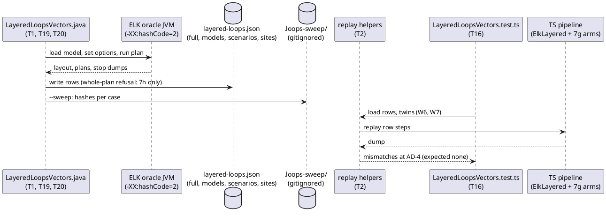
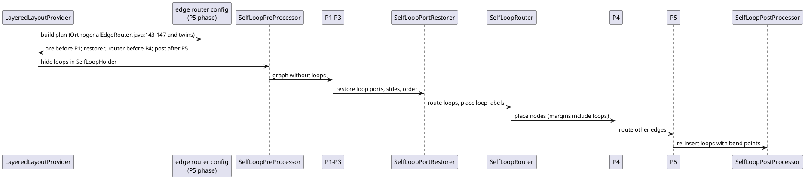

<!-- SPDX-License-Identifier: EPL-2.0 -->

# Data flow — mission 7g evidence

How an expectation travels from the oracle to a green TS test (AD-13: recorded before the port exists).

```plantuml
@startuml
participant "LayeredLoopsVectors.java\n(T1, T19, T20)" as rec
participant "ELK oracle JVM\n(-XX:hashCode=2)" as jvm
database "layered-loops.json\n(full, models, scenarios, sites)" as ref
database ".loops-sweep/\n(gitignored)" as sweep
participant "replay helpers\n(T2)" as helpers
participant "LayeredLoopsVectors.test.ts\n(T16)" as vt
participant "TS pipeline\n(ElkLayered + 7g arms)" as ts
rec -> jvm : load model, set options, run plan
jvm --> rec : layout, plans, stop dumps
rec -> ref : write rows (whole-plan refusal: 7h only)
rec -> sweep : --sweep: hashes per case
vt -> helpers : load rows, twins (W6, W7)
helpers -> ts : replay row steps
ts --> helpers : dump
helpers --> vt : mismatches at AD-4 (expected none)
@enduml
```

```plantuml
@startuml
participant "LayeredLayoutProvider" as prov
participant "edge router config\n(P5 phase)" as conf
participant "SelfLoopPreProcessor" as pre
participant "P1-P3" as p13
participant "SelfLoopPortRestorer" as rest
participant "SelfLoopRouter" as router
participant "P4" as p4
participant "P5" as p5
participant "SelfLoopPostProcessor" as post
prov -> conf : build plan (OrthogonalEdgeRouter.java:143-147 and twins)
conf --> prov : pre before P1; restorer, router before P4; post after P5
prov -> pre : hide loops in SelfLoopHolder
pre -> p13 : graph without loops
p13 -> rest : restore loop ports, sides, order
rest -> router : route loops, place loop labels
router -> p4 : place nodes (margins include loops)
p4 -> p5 : route other edges
p5 -> post : re-insert loops with bend points
@enduml
```
