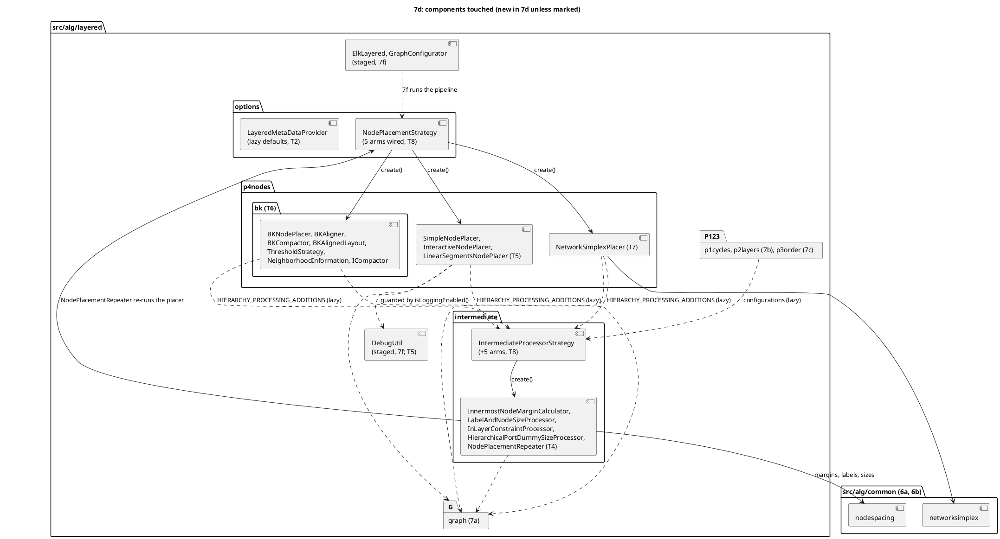
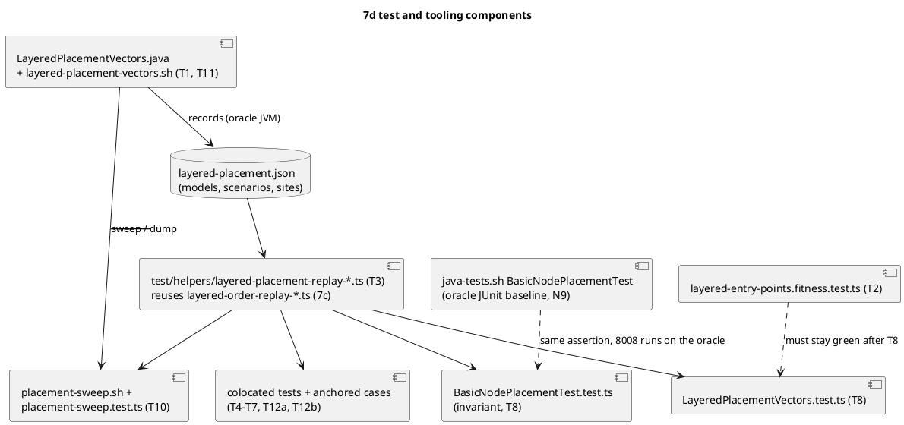

<!-- SPDX-License-Identifier: EPL-2.0 -->

# Component map — layered-node-placement (mission 7d)

```plantuml
@startuml
title 7d: components touched (new in 7d unless marked)
package "src/alg/layered" {
  package "options" {
    component "NodePlacementStrategy\n(5 arms wired, T8)" as NPS
    component "LayeredMetaDataProvider\n(lazy defaults, T2)" as MDP
  }
  package "graph (7a)" as G
  package "p1cycles, p2layers (7b), p3order (7c)" as P123
  package "intermediate" {
    component "IntermediateProcessorStrategy\n(+5 arms, T8)" as IPS
    component "InnermostNodeMarginCalculator,\nLabelAndNodeSizeProcessor,\nInLayerConstraintProcessor,\nHierarchicalPortDummySizeProcessor,\nNodePlacementRepeater (T4)" as PRE
  }
  package "p4nodes" {
    component "SimpleNodePlacer,\nInteractiveNodePlacer,\nLinearSegmentsNodePlacer (T5)" as SIL
    component "NetworkSimplexPlacer (T7)" as NSP
    package "bk (T6)" {
      component "BKNodePlacer, BKAligner,\nBKCompactor, BKAlignedLayout,\nThresholdStrategy,\nNeighborhoodInformation, ICompactor" as BK
    }
  }
  component "DebugUtil\n(staged, 7f; T5)" as DBG
  component "ElkLayered, GraphConfigurator\n(staged, 7f)" as EL
}
package "src/alg/common (6a, 6b)" {
  component "networksimplex" as NS
  component "nodespacing" as NSP6
}
NPS --> SIL : create()
NPS --> NSP : create()
NPS --> BK : create()
IPS --> PRE : create()
PRE --> NPS : NodePlacementRepeater re-runs the placer
NSP --> NS
PRE --> NSP6 : margins, labels, sizes
SIL ..> DBG : guarded by isLoggingEnabled()
SIL ..> G
NSP ..> G
BK ..> G
PRE ..> G
P123 ..> IPS : configurations (lazy)
SIL ..> IPS : HIERARCHY_PROCESSING_ADDITIONS (lazy)
BK ..> IPS : HIERARCHY_PROCESSING_ADDITIONS (lazy)
NSP ..> IPS : HIERARCHY_PROCESSING_ADDITIONS (lazy)
EL ..> NPS : 7f runs the pipeline
@enduml
```

```plantuml
@startuml
title 7d test and tooling components
component "LayeredPlacementVectors.java\n+ layered-placement-vectors.sh (T1, T11)" as REC
database "layered-placement.json\n(models, scenarios, sites)" as REF
component "test/helpers/layered-placement-replay-*.ts (T3)\nreuses layered-order-replay-*.ts (7c)" as HLP
component "LayeredPlacementVectors.test.ts (T8)" as GEN
component "BasicNodePlacementTest.test.ts\n(invariant, T8)" as INV
component "colocated tests + anchored cases\n(T4-T7, T12a, T12b)" as UNIT
component "placement-sweep.sh +\nplacement-sweep.test.ts (T10)" as SWP
component "layered-entry-points.fitness.test.ts (T2)" as FIT
component "java-tests.sh BasicNodePlacementTest\n(oracle JUnit baseline, N9)" as JUT
REC --> REF : records (oracle JVM)
REF --> HLP
HLP --> GEN
HLP --> INV
HLP --> UNIT
REC --> SWP : --sweep / --dump
HLP --> SWP
FIT ..> GEN : must stay green after T8
JUT ..> INV : same assertion, 8008 runs on the oracle
@enduml
```
