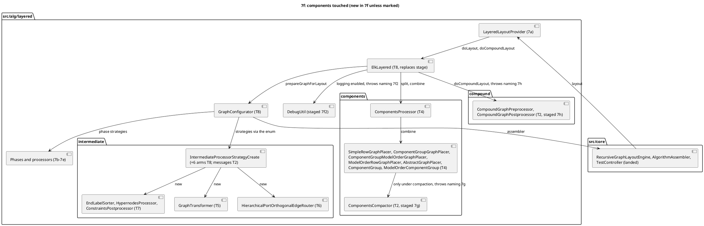

<!-- SPDX-License-Identifier: EPL-2.0 -->

# Component map — layered-pipeline (mission 7f)

```plantuml
@startuml
title 7f: components touched (new in 7f unless marked)
package "src/alg/layered" {
  component "LayeredLayoutProvider (7a)" as LLP
  component "ElkLayered (T8, replaces stage)" as EL
  component "GraphConfigurator (T8)" as GC
  package "components" {
    component "ComponentsProcessor (T4)" as CP
    component "SimpleRowGraphPlacer, ComponentGroupGraphPlacer,\nComponentGroupModelOrderGraphPlacer,\nModelOrderRowGraphPlacer, AbstractGraphPlacer,\nComponentGroup, ModelOrderComponentGroup (T4)" as PL
    component "ComponentsCompactor (T2, staged 7g)" as CC
  }
  package "compound" {
    component "CompoundGraphPreprocessor,\nCompoundGraphPostprocessor (T2, staged 7h)" as CG
  }
  package "intermediate" {
    component "IntermediateProcessorStrategyCreate\n(+6 arms T8; messages T2)" as IPC
    component "GraphTransformer (T5)" as GT
    component "HierarchicalPortOrthogonalEdgeRouter (T6)" as HP
    component "EndLabelSorter, HypernodesProcessor,\nConstraintsPostprocessor (T7)" as P3
  }
  component "Phases and processors (7b-7e)" as PREV
  component "DebugUtil (staged 7f2)" as DBG
}
package "src/core" {
  component "RecursiveGraphLayoutEngine, AlgorithmAssembler,\nTestController (landed)" as CORE
}
LLP --> EL : doLayout, doCompoundLayout
CORE --> LLP : layout
EL --> GC : prepareGraphForLayout
EL --> CP : split, combine
EL --> CG : doCompoundLayout, throws naming 7h
EL --> DBG : logging enabled, throws naming 7f2
GC --> CORE : assembler
GC --> IPC : strategies via the enum
GC --> PREV : phase strategies
CP --> PL : combine
PL --> CC : only under compaction, throws naming 7g
IPC --> GT : new
IPC --> HP : new
IPC --> P3 : new
@enduml
```
