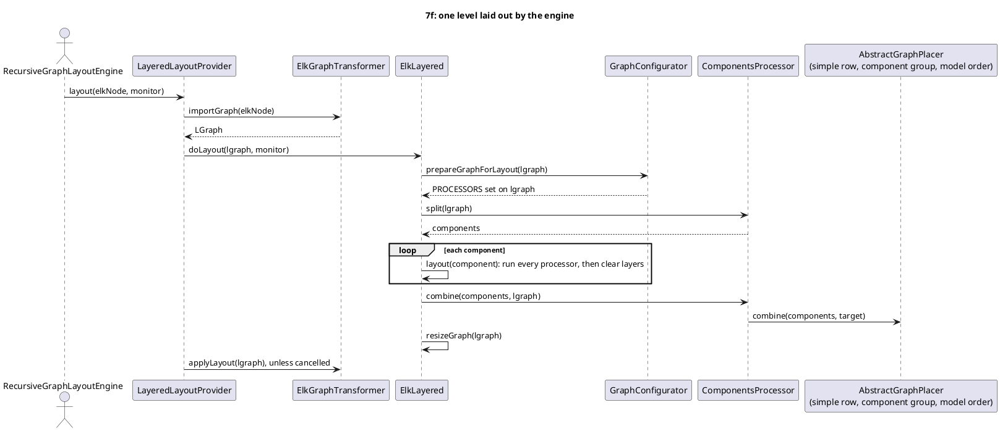
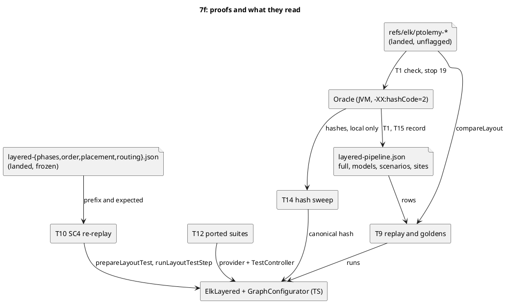

<!-- SPDX-License-Identifier: EPL-2.0 -->

# Data flow — layered-pipeline (mission 7f)

## A flat layout through the real driver

```plantuml
@startuml
title 7f: one level laid out by the engine
actor "RecursiveGraphLayoutEngine" as RGLE
participant "LayeredLayoutProvider" as LLP
participant "ElkGraphTransformer" as EGT
participant "ElkLayered" as EL
participant "GraphConfigurator" as GC
participant "ComponentsProcessor" as CP
participant "AbstractGraphPlacer\n(simple row, component group, model order)" as AGP
RGLE -> LLP : layout(elkNode, monitor)
LLP -> EGT : importGraph(elkNode)
EGT --> LLP : LGraph
LLP -> EL : doLayout(lgraph, monitor)
EL -> GC : prepareGraphForLayout(lgraph)
GC --> EL : PROCESSORS set on lgraph
EL -> CP : split(lgraph)
CP --> EL : components
loop each component
  EL -> EL : layout(component): run every processor, then clear layers
end
EL -> CP : combine(components, lgraph)
CP -> AGP : combine(components, target)
EL -> EL : resizeGraph(lgraph)
LLP -> EGT : applyLayout(lgraph), unless cancelled
@enduml
```

## How each kind of proof reaches the port

```plantuml
@startuml
title 7f: proofs and what they read
rectangle "Oracle (JVM, -XX:hashCode=2)" as O
file "layered-pipeline.json\nfull, models, scenarios, sites" as REF
file "layered-{phases,order,placement,routing}.json\n(landed, frozen)" as LANDED
file "refs/elk/ptolemy-*\n(landed, unflagged)" as GOLD
rectangle "ElkLayered + GraphConfigurator (TS)" as TS
rectangle "T9 replay and goldens" as T9
rectangle "T10 SC4 re-replay" as T10
rectangle "T12 ported suites" as T12
rectangle "T14 hash sweep" as T14
O --> REF : T1, T15 record
O --> T14 : hashes, local only
GOLD --> O : T1 check, stop 19
REF --> T9 : rows
GOLD --> T9 : compareLayout
LANDED --> T10 : prefix and expected
T9 --> TS : runs
T10 --> TS : prepareLayoutTest, runLayoutTestStep
T12 --> TS : provider + TestController
T14 --> TS : canonical hash
@enduml
```
