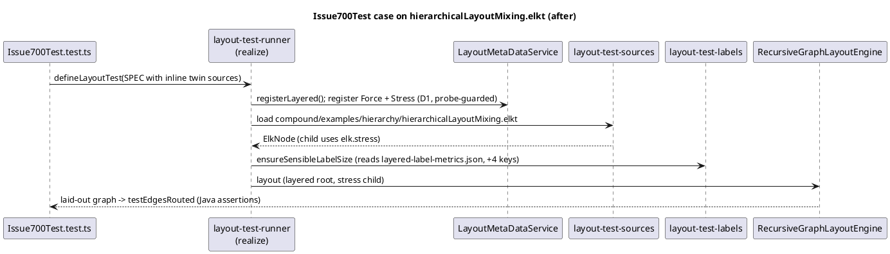

<!-- SPDX-License-Identifier: EPL-2.0 -->

# Data flow: one stress-dependent case after the mission

```plantuml
@startuml
title Issue700Test case on hierarchicalLayoutMixing.elkt (after)
participant "Issue700Test.test.ts" as S
participant "layout-test-runner\n(realize)" as R
participant "LayoutMetaDataService" as M
participant "layout-test-sources" as F
participant "layout-test-labels" as L
participant "RecursiveGraphLayoutEngine" as E
S -> R : defineLayoutTest(SPEC with inline twin sources)
R -> M : registerLayered(); register Force + Stress (D1, probe-guarded)
R -> F : load compound/examples/hierarchy/hierarchicalLayoutMixing.elkt
F --> R : ElkNode (child uses elk.stress)
R -> L : ensureSensibleLabelSize (reads layered-label-metrics.json, +4 keys)
R -> E : layout (layered root, stress child)
E --> S : laid-out graph -> testEdgesRouted (Java assertions)
@enduml
```
