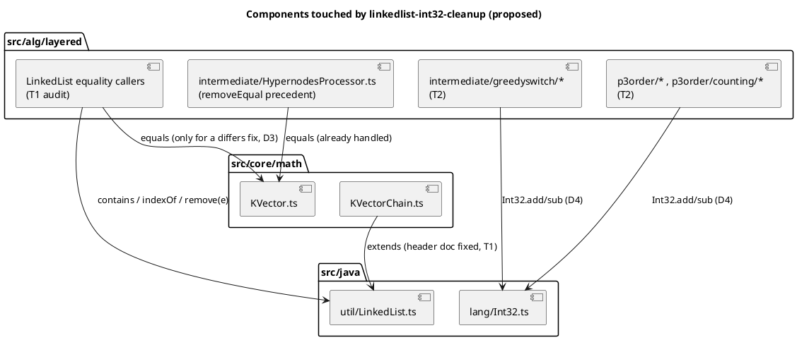

<!-- SPDX-License-Identifier: EPL-2.0 -->

# Component map: linkedlist-int32-cleanup

```plantuml
@startuml
title Components touched by linkedlist-int32-cleanup (proposed)
package "src/java" {
  [util/LinkedList.ts] as LL
  [lang/Int32.ts] as I32
}
package "src/core/math" {
  [KVectorChain.ts] as KVC
  [KVector.ts] as KV
}
package "src/alg/layered" {
  [LinkedList equality callers\n(T1 audit)] as CALLERS
  [intermediate/HypernodesProcessor.ts\n(removeEqual precedent)] as HP
  [intermediate/greedyswitch/*\n(T2)] as GS
  [p3order/* , p3order/counting/*\n(T2)] as P3
}
KVC --> LL : extends (header doc fixed, T1)
CALLERS --> LL : contains / indexOf / remove(e)
CALLERS --> KV : equals (only for a differs fix, D3)
HP --> KV : equals (already handled)
GS --> I32 : Int32.add/sub (D4)
P3 --> I32 : Int32.add/sub (D4)
@enduml
```
