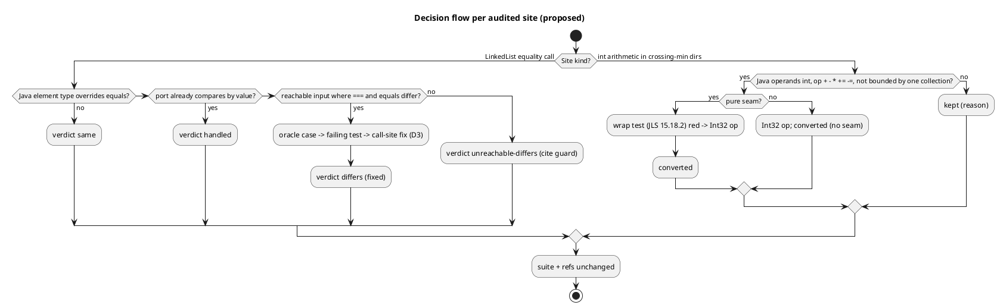

<!-- SPDX-License-Identifier: EPL-2.0 -->

# Data flow: linkedlist-int32-cleanup

How a caller is decided (T1) and how an `int` site is decided (T2).

```plantuml
@startuml
title Decision flow per audited site (proposed)
start
if (Site kind?) then (LinkedList equality call)
  if (Java element type overrides equals?) then (no)
    :verdict same;
  elseif (port already compares by value?) then (yes)
    :verdict handled;
  elseif (reachable input where === and equals differ?) then (yes)
    :oracle case -> failing test -> call-site fix (D3);
    :verdict differs (fixed);
  else (no)
    :verdict unreachable-differs (cite guard);
  endif
else (int arithmetic in crossing-min dirs)
  if (Java operands int, op + - * += -=, not bounded by one collection?) then (yes)
    if (pure seam?) then (yes)
      :wrap test (JLS 15.18.2) red -> Int32 op;
      :converted;
    else (no)
      :Int32 op; converted (no seam);
    endif
  else (no)
    :kept (reason);
  endif
endif
:suite + refs unchanged;
stop
@enduml
```
