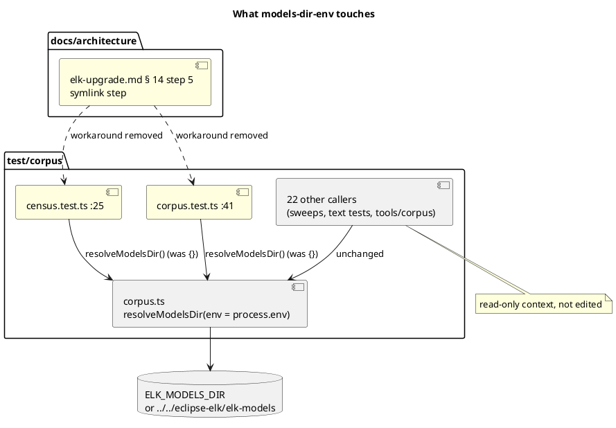

<!-- SPDX-License-Identifier: EPL-2.0 -->

# Component map: models-dir-env

```plantuml
@startuml
title What models-dir-env touches
package "test/corpus" {
  [corpus.ts\nresolveModelsDir(env = process.env)] as R
  [census.test.ts :25] as C #lightyellow
  [corpus.test.ts :41] as K #lightyellow
  [22 other callers\n(sweeps, text tests, tools/corpus)] as O
}
package "docs/architecture" {
  [elk-upgrade.md § 14 step 5\nsymlink step] as D #lightyellow
}
database "ELK_MODELS_DIR\nor ../../eclipse-elk/elk-models" as M
C --> R : resolveModelsDir() (was {})
K --> R : resolveModelsDir() (was {})
O --> R : unchanged
R --> M
D ..> C : workaround removed
D ..> K : workaround removed
note bottom of O : read-only context, not edited
@enduml
```
