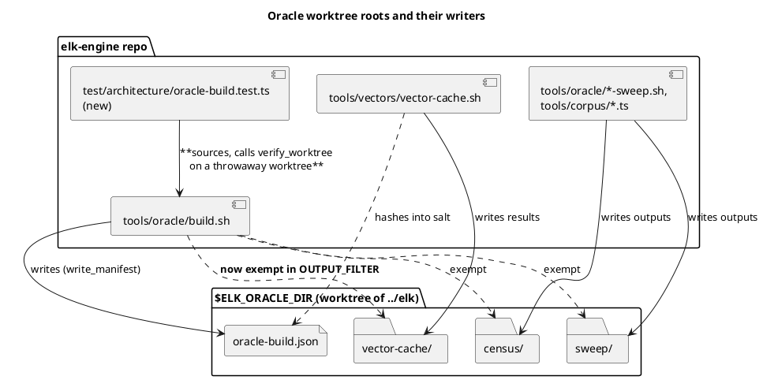

<!-- SPDX-License-Identifier: EPL-2.0 -->

# Component map: oracle-stale-caches

Who writes what at the oracle worktree root, and what the mission changes (bold labels).

```plantuml
@startuml
title Oracle worktree roots and their writers
package "elk-engine repo" {
  [tools/oracle/build.sh] as build
  [tools/vectors/vector-cache.sh] as vc
  [tools/oracle/*-sweep.sh,\ntools/corpus/*.ts] as sweeps
  [test/architecture/oracle-build.test.ts\n(new)] as test
}
package "$ELK_ORACLE_DIR (worktree of ../elk)" {
  folder "vector-cache/" as cache
  folder "sweep/" as sweep
  folder "census/" as census
  file "oracle-build.json" as manifest
}
vc --> cache : writes results
sweeps --> sweep : writes outputs
sweeps --> census : writes outputs
build --> manifest : writes (write_manifest)
vc ..> manifest : hashes into salt
build ..> cache : **now exempt in OUTPUT_FILTER**
build ..> sweep : exempt
build ..> census : exempt
test --> build : **sources, calls verify_worktree\non a throwaway worktree**
@enduml
```
