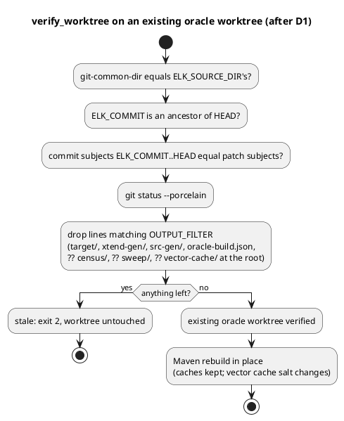

<!-- SPDX-License-Identifier: EPL-2.0 -->

# Data flow: oracle-stale-caches

The decision `verify_worktree` makes on an existing worktree, after D1. Only the filter box changes.

```plantuml
@startuml
title verify_worktree on an existing oracle worktree (after D1)
start
:git-common-dir equals ELK_SOURCE_DIR's?;
:ELK_COMMIT is an ancestor of HEAD?;
:commit subjects ELK_COMMIT..HEAD equal patch subjects?;
:git status --porcelain;
:drop lines matching OUTPUT_FILTER\n(target/, xtend-gen/, src-gen/, oracle-build.json,\n?? census/, ?? sweep/, ?? vector-cache/ at the root);
if (anything left?) then (yes)
  :stale: exit 2, worktree untouched;
  stop
else (no)
  :existing oracle worktree verified;
  :Maven rebuild in place\n(caches kept; vector cache salt changes);
  stop
endif
@enduml
```
