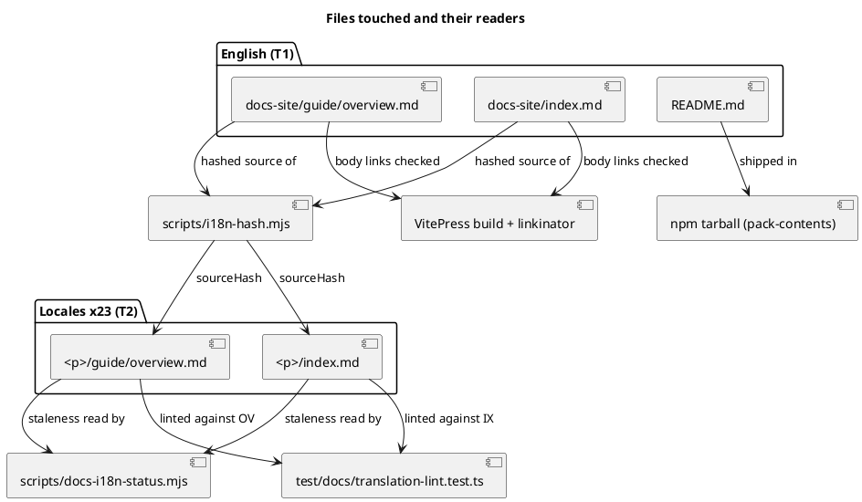

<!-- SPDX-License-Identifier: EPL-2.0 -->

# Component map: overview-status

What the mission touches and what reads it. Nothing under `src/`, `test/` or `.vitepress/` changes.

```plantuml
@startuml
title Files touched and their readers
package "English (T1)" {
  [docs-site/guide/overview.md] as OV
  [docs-site/index.md] as IX
  [README.md] as RD
}
package "Locales x23 (T2)" {
  [<p>/guide/overview.md] as LOV
  [<p>/index.md] as LIX
}
[scripts/i18n-hash.mjs] as H
[scripts/docs-i18n-status.mjs] as ST
[test/docs/translation-lint.test.ts] as LT
[VitePress build + linkinator] as VB
[npm tarball (pack-contents)] as PK
OV --> H : hashed source of
IX --> H : hashed source of
H --> LOV : sourceHash
H --> LIX : sourceHash
LOV --> ST : staleness read by
LIX --> ST : staleness read by
LOV --> LT : linted against OV
LIX --> LT : linted against IX
OV --> VB : body links checked
IX --> VB : body links checked
RD --> PK : shipped in
@enduml
```
