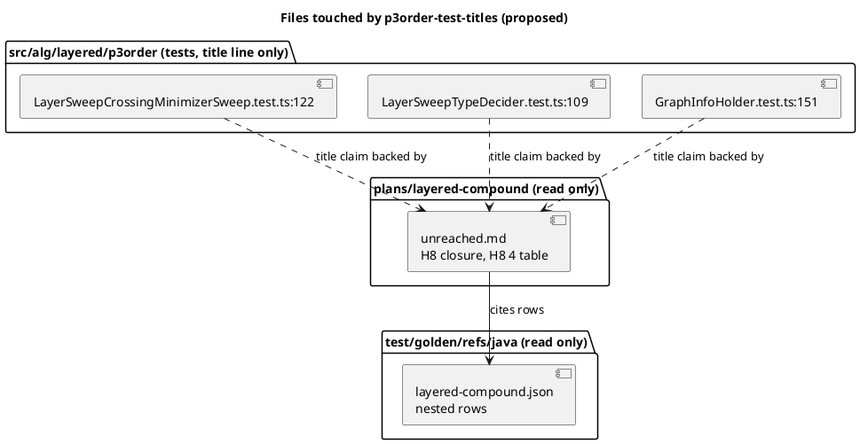

<!-- SPDX-License-Identifier: EPL-2.0 -->

# Component map: p3order-test-titles

```plantuml
@startuml
title Files touched by p3order-test-titles (proposed)
package "src/alg/layered/p3order (tests, title line only)" {
  [LayerSweepCrossingMinimizerSweep.test.ts:122] as SW
  [LayerSweepTypeDecider.test.ts:109] as TD
  [GraphInfoHolder.test.ts:151] as GI
}
package "plans/layered-compound (read only)" {
  [unreached.md\nH8 closure, H8 4 table] as UR
}
package "test/golden/refs/java (read only)" {
  [layered-compound.json\nnested rows] as REF
}
UR --> REF : cites rows
SW ..> UR : title claim backed by
TD ..> UR : title claim backed by
GI ..> UR : title claim backed by
@enduml
```
