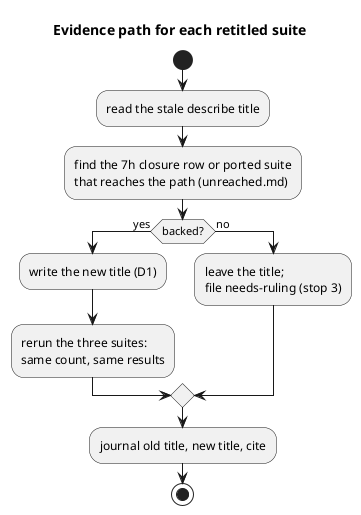

<!-- SPDX-License-Identifier: EPL-2.0 -->

# Data flow: p3order-test-titles

No runtime data flow changes: the mission edits three test titles. The flow below is the executor's evidence path.

```plantuml
@startuml
title Evidence path for each retitled suite
start
:read the stale describe title;
:find the 7h closure row or ported suite\nthat reaches the path (unreached.md);
if (backed?) then (yes)
  :write the new title (D1);
  :rerun the three suites:\nsame count, same results;
else (no)
  :leave the title;\nfile needs-ruling (stop 3);
endif
:journal old title, new title, cite;
stop
@enduml
```
