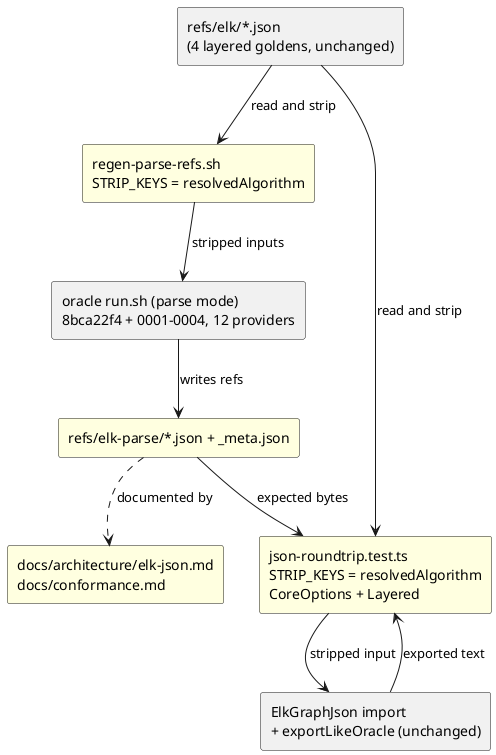

<!-- SPDX-License-Identifier: EPL-2.0 -->

# Component map

```plantuml
@startuml
skinparam componentStyle rectangle
component "refs/elk/*.json\n(4 layered goldens, unchanged)" as G
component "regen-parse-refs.sh\nSTRIP_KEYS = resolvedAlgorithm" as S #LightYellow
component "oracle run.sh (parse mode)\n8bca22f4 + 0001-0004, 12 providers" as O
component "refs/elk-parse/*.json + _meta.json" as R #LightYellow
component "json-roundtrip.test.ts\nSTRIP_KEYS = resolvedAlgorithm\nCoreOptions + Layered" as T #LightYellow
component "ElkGraphJson import\n+ exportLikeOracle (unchanged)" as P
component "docs/architecture/elk-json.md\ndocs/conformance.md" as D #LightYellow

G --> S : read and strip
S --> O : stripped inputs
O --> R : writes refs
G --> T : read and strip
T --> P : stripped input
P --> T : exported text
R --> T : expected bytes
R ..> D : documented by
@enduml
```

Yellow components change in this mission.
