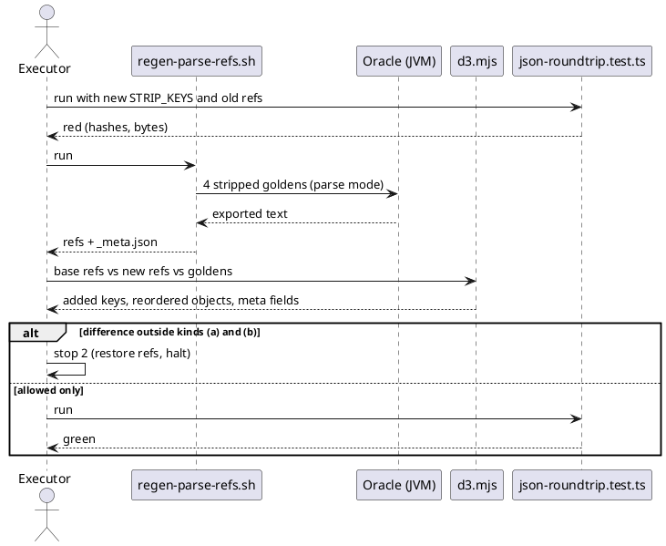

<!-- SPDX-License-Identifier: EPL-2.0 -->

# Data flow: regeneration and proof (T1)

```plantuml
@startuml
actor Executor
participant "regen-parse-refs.sh" as S
participant "Oracle (JVM)" as O
participant "d3.mjs" as D
participant "json-roundtrip.test.ts" as T

Executor -> T : run with new STRIP_KEYS and old refs
T --> Executor : red (hashes, bytes)
Executor -> S : run
S -> O : 4 stripped goldens (parse mode)
O --> S : exported text
S --> Executor : refs + _meta.json
Executor -> D : base refs vs new refs vs goldens
D --> Executor : added keys, reordered objects, meta fields
alt difference outside kinds (a) and (b)
  Executor -> Executor : stop 2 (restore refs, halt)
else allowed only
  Executor -> T : run
  T --> Executor : green
end
@enduml
```
