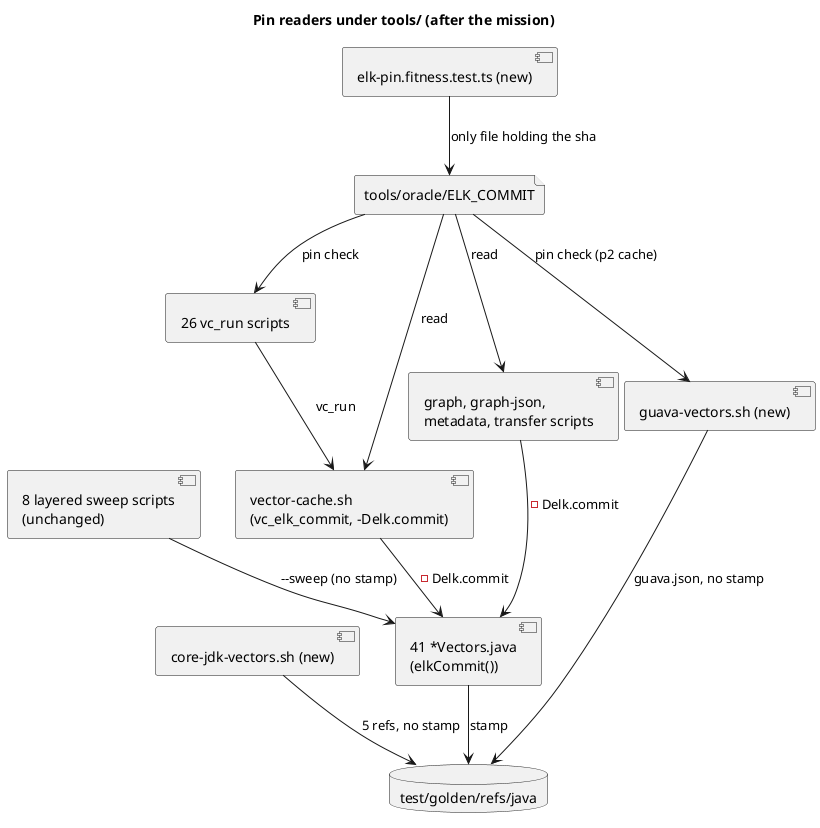

<!-- SPDX-License-Identifier: EPL-2.0 -->

# Component map: recorder-pin-source

What changes and what reads the pin after the mission.

```plantuml
@startuml
title Pin readers under tools/ (after the mission)
file "tools/oracle/ELK_COMMIT" as pin
component "26 vc_run scripts" as cached
component "vector-cache.sh\n(vc_elk_commit, -Delk.commit)" as vc
component "graph, graph-json,\nmetadata, transfer scripts" as direct
component "41 *Vectors.java\n(elkCommit())" as rec
component "8 layered sweep scripts\n(unchanged)" as sweeps
component "core-jdk-vectors.sh (new)" as jdk
component "guava-vectors.sh (new)" as guava
component "elk-pin.fitness.test.ts (new)" as fit
database "test/golden/refs/java" as refs
pin --> cached : pin check
pin --> vc : read
pin --> direct : read
pin --> guava : pin check (p2 cache)
cached --> vc : vc_run
vc --> rec : -Delk.commit
direct --> rec : -Delk.commit
sweeps --> rec : --sweep (no stamp)
rec --> refs : stamp
jdk --> refs : 5 refs, no stamp
guava --> refs : guava.json, no stamp
fit --> pin : only file holding the sha
@enduml
```
