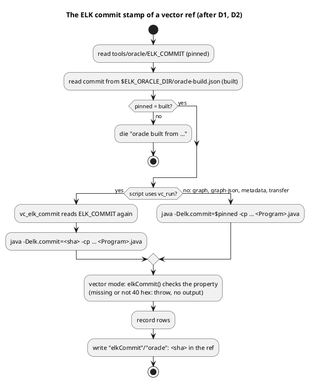

<!-- SPDX-License-Identifier: EPL-2.0 -->

# Data flow: recorder-pin-source

How the stamp reaches a vector ref after D1/D2. Before: the stamp came from a constant in the recorder's source.

```plantuml
@startuml
title The ELK commit stamp of a vector ref (after D1, D2)
start
:read tools/oracle/ELK_COMMIT (pinned);
:read commit from $ELK_ORACLE_DIR/oracle-build.json (built);
if (pinned = built?) then (no)
  :die "oracle built from …";
  stop
else (yes)
endif
if (script uses vc_run?) then (yes)
  :vc_elk_commit reads ELK_COMMIT again;
  :java -Delk.commit=<sha> -cp … <Program>.java;
else (no: graph, graph-json, metadata, transfer)
  :java -Delk.commit=$pinned -cp … <Program>.java;
endif
:vector mode: elkCommit() checks the property\n(missing or not 40 hex: throw, no output);
:record rows;
:write "elkCommit"/"oracle": <sha> in the ref;
stop
@enduml
```
