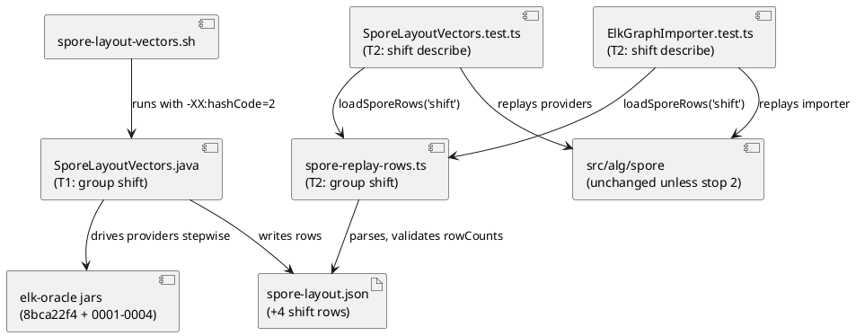

<!-- SPDX-License-Identifier: EPL-2.0 -->

# spore-jitter-exact: component map

```plantuml
@startuml
component "SporeLayoutVectors.java\n(T1: group shift)" as REC
component "spore-layout-vectors.sh" as SH
component "elk-oracle jars\n(8bca22f4 + 0001-0004)" as ORA
artifact "spore-layout.json\n(+4 shift rows)" as REF
component "spore-replay-rows.ts\n(T2: group shift)" as ROWS
component "SporeLayoutVectors.test.ts\n(T2: shift describe)" as TV
component "ElkGraphImporter.test.ts\n(T2: shift describe)" as TI
component "src/alg/spore\n(unchanged unless stop 2)" as PORT
SH --> REC : runs with -XX:hashCode=2
REC --> ORA : drives providers stepwise
REC --> REF : writes rows
ROWS --> REF : parses, validates rowCounts
TV --> ROWS : loadSporeRows('shift')
TI --> ROWS : loadSporeRows('shift')
TV --> PORT : replays providers
TI --> PORT : replays importer
@enduml
```
