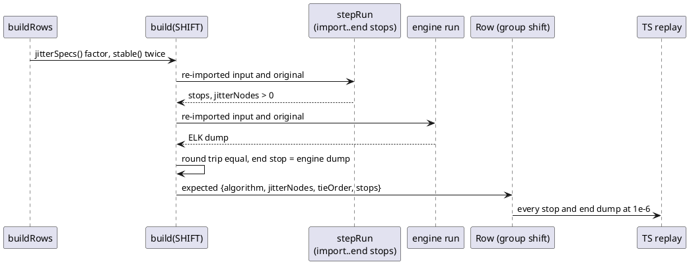

<!-- SPDX-License-Identifier: EPL-2.0 -->

# spore-jitter-exact: data flow of one `shift` row

```plantuml
@startuml
participant "buildRows" as B
participant "build(SHIFT)" as BU
participant "stepRun\n(import..end stops)" as S
participant "engine run" as E
participant "Row (group shift)" as R
participant "TS replay" as T
B -> BU : jitterSpecs() factor, stable() twice
BU -> S : re-imported input and original
S --> BU : stops, jitterNodes > 0
BU -> E : re-imported input and original
E --> BU : ELK dump
BU -> BU : round trip equal, end stop = engine dump
BU -> R : expected {algorithm, jitterNodes, tieOrder, stops}
R -> T : every stop and end dump at 1e-6
@enduml
```
