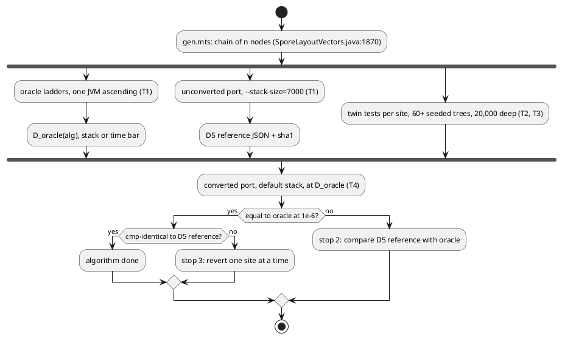

<!-- SPDX-License-Identifier: EPL-2.0 -->

# Data flow: the evidence chain

How a result moves from the probe inputs to the done verdict per algorithm (D1, D4, D5).

```plantuml
@startuml
start
:gen.mts: chain of n nodes (SporeLayoutVectors.java:1870);
fork
  :oracle ladders, one JVM ascending (T1);
  :D_oracle(alg), stack or time bar;
fork again
  :unconverted port, --stack-size=7000 (T1);
  :D5 reference JSON + sha1;
fork again
  :twin tests per site, 60+ seeded trees, 20,000 deep (T2, T3);
end fork
:converted port, default stack, at D_oracle (T4);
if (equal to oracle at 1e-6?) then (yes)
  if (cmp-identical to D5 reference?) then (yes)
    :algorithm done;
  else (no)
    :stop 3: revert one site at a time;
  endif
else (no)
  :stop 2: compare D5 reference with oracle;
endif
stop
@enduml
```
