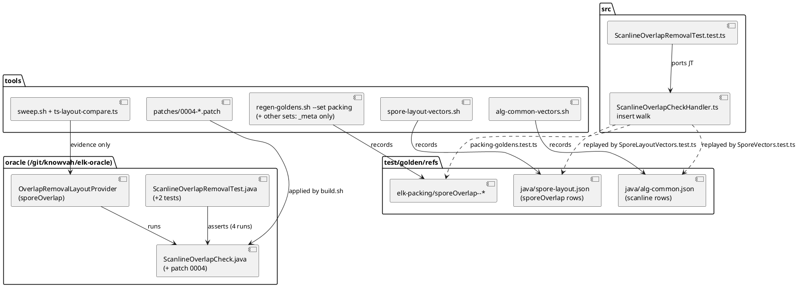

<!-- SPDX-License-Identifier: EPL-2.0 -->

# Component map: spore-scanline-0004

```plantuml
@startuml
package "oracle (~/git/knowvah/elk-oracle)" {
  [ScanlineOverlapCheck.java\n(+ patch 0004)] as J
  [ScanlineOverlapRemovalTest.java\n(+2 tests)] as JT
  [OverlapRemovalLayoutProvider\n(sporeOverlap)] as OP
}
package "tools" {
  [patches/0004-*.patch] as P
  [alg-common-vectors.sh] as AV
  [spore-layout-vectors.sh] as SV
  [regen-goldens.sh --set packing\n(+ other sets: _meta only)] as RG
  [sweep.sh + ts-layout-compare.ts] as SW
}
package "src" {
  [ScanlineOverlapCheckHandler.ts\ninsert walk] as H
  [ScanlineOverlapRemovalTest.test.ts] as HT
}
package "test/golden/refs" {
  [java/alg-common.json\n(scanline rows)] as RA
  [java/spore-layout.json\n(sporeOverlap rows)] as RS
  [elk-packing/sporeOverlap--*] as RP
}
P --> J : applied by build.sh
OP --> J : runs
JT --> J : asserts (4 runs)
AV --> RA : records
SV --> RS : records
RG --> RP : records
HT --> H : ports JT
H ..> RA : replayed by SporeVectors.test.ts
H ..> RS : replayed by SporeLayoutVectors.test.ts
H ..> RP : packing-goldens.test.ts
SW --> OP : evidence only
@enduml
```
