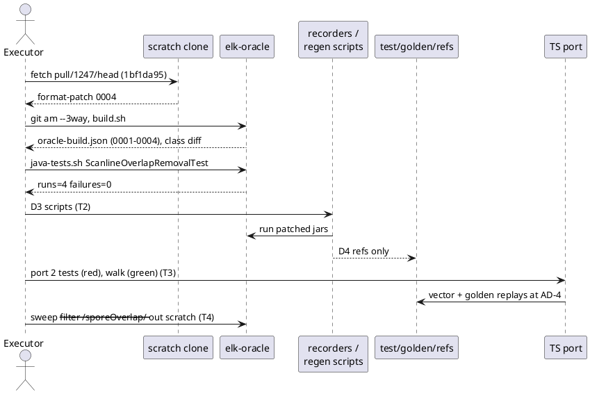

<!-- SPDX-License-Identifier: EPL-2.0 -->

# Data flow: spore-scanline-0004

```plantuml
@startuml
actor Executor
participant "scratch clone" as SC
participant "elk-oracle" as O
participant "recorders /\nregen scripts" as R
participant "test/golden/refs" as Refs
participant "TS port" as TS

Executor -> SC : fetch pull/1247/head (1bf1da95)
SC --> Executor : format-patch 0004
Executor -> O : git am --3way, build.sh
O --> Executor : oracle-build.json (0001-0004), class diff
Executor -> O : java-tests.sh ScanlineOverlapRemovalTest
O --> Executor : runs=4 failures=0
Executor -> R : D3 scripts (T2)
R -> O : run patched jars
R --> Refs : D4 refs only
Executor -> TS : port 2 tests (red), walk (green) (T3)
TS -> Refs : vector + golden replays at AD-4
Executor -> O : sweep --filter /sporeOverlap/ --out scratch (T4)
@enduml
```
