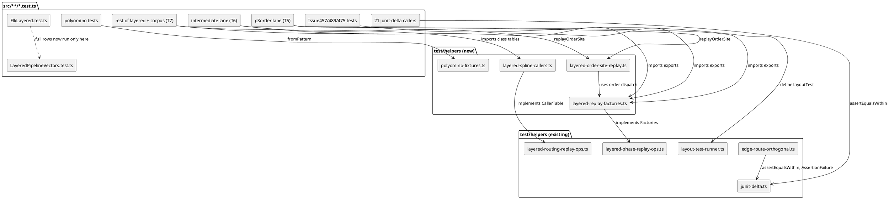

<!-- SPDX-License-Identifier: EPL-2.0 -->

# Component map: test-helper-consolidation (proposed)

```plantuml
@startuml
skinparam componentStyle rectangle
package "test/helpers (new)" {
  [layered-replay-factories.ts] as F
  [layered-order-site-replay.ts] as O
  [layered-spline-callers.ts] as C
  [polyomino-fixtures.ts] as P
}
package "test/helpers (existing)" {
  [junit-delta.ts] as J
  [edge-route-orthogonal.ts] as E
  [layout-test-runner.ts] as R
  [layered-phase-replay-ops.ts] as PH
  [layered-routing-replay-ops.ts] as RO
}
package "src/**/*.test.ts" {
  [p3order lane (T5)] as L5
  [intermediate lane (T6)] as L6
  [rest of layered + corpus (T7)] as L7
  [Issue457/489/475 tests] as I
  [polyomino tests] as PT
  [21 junit-delta callers] as JC
  [ElkLayered.test.ts] as EL
  [LayeredPipelineVectors.test.ts] as PV
}
O --> F : uses order dispatch
F --> PH : implements Factories
C --> RO : implements CallerTable
L5 --> O : replayOrderSite
L6 --> O : replayOrderSite
L5 --> F : imports exports
L6 --> F : imports exports
L7 --> F : imports exports
L7 --> C : imports class tables
E --> J : assertEqualsWithin, AssertionFailure
JC --> J : assertEqualsWithin
I --> R : defineLayoutTest
PT --> P : fromPattern
EL ..> PV : full rows now run only here
@enduml
```
