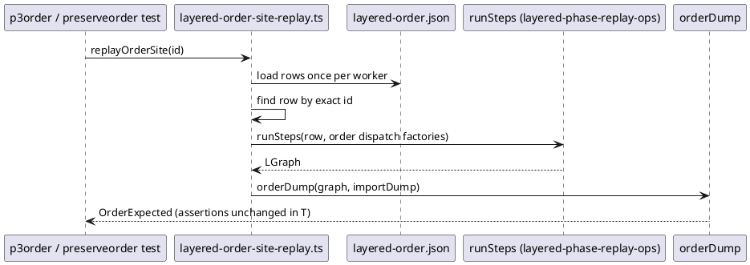
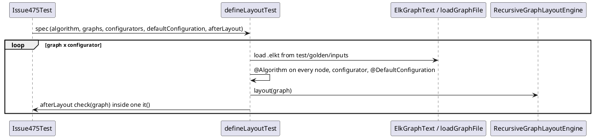
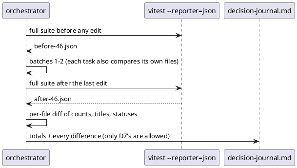

<!-- SPDX-License-Identifier: EPL-2.0 -->

# Data flow: test-helper-consolidation

## An order site row after the move (D2)

```plantuml
@startuml
participant "p3order / preserveorder test" as T
participant "layered-order-site-replay.ts" as O
participant "layered-order.json" as J
participant "runSteps (layered-phase-replay-ops)" as S
participant "orderDump" as D
T -> O : replayOrderSite(id)
O -> J : load rows once per worker
O -> O : find row by exact id
O -> S : runSteps(row, order dispatch factories)
S --> O : LGraph
O -> D : orderDump(graph, importDump)
D --> T : OrderExpected (assertions unchanged in T)
@enduml
```

## A harness suite on the runner (D4)

```plantuml
@startuml
participant "Issue475Test" as T
participant "defineLayoutTest" as R
participant "ElkGraphText / loadGraphFile" as L
participant "RecursiveGraphLayoutEngine" as E
T -> R : spec (algorithm, graphs, configurators, defaultConfiguration, afterLayout)
loop graph x configurator
  R -> L : load .elkt from test/golden/inputs
  R -> R : @Algorithm on every node, configurator, @DefaultConfiguration
  R -> E : layout(graph)
  R -> T : afterLayout check(graph) inside one it()
end
@enduml
```

## The case-count proof (D7)

```plantuml
@startuml
participant "orchestrator" as O
participant "vitest --reporter=json" as V
participant "decision-journal.md" as J
O -> V : full suite before any edit
V --> O : before-46.json
O -> O : batches 1-2 (each task also compares its own files)
O -> V : full suite after the last edit
V --> O : after-46.json
O -> O : per-file diff of counts, titles, statuses
O -> J : totals + every difference (only D7's are allowed)
@enduml
```
