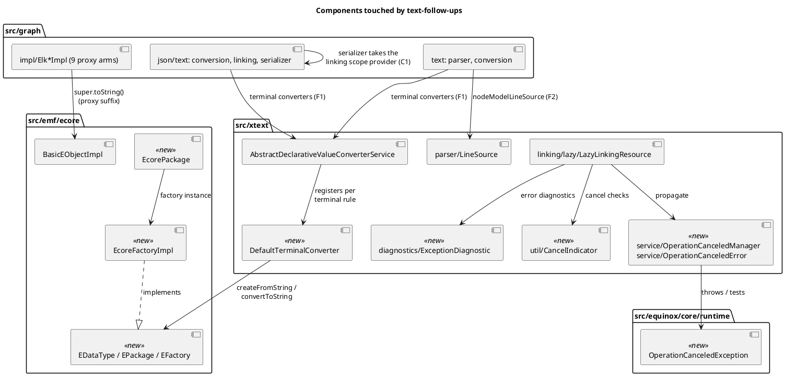

<!-- SPDX-License-Identifier: EPL-2.0 -->

# Component map: text-follow-ups

Proposed state after the mission. New components are marked `<<new>>`; arrows are imports.

```plantuml
@startuml
title Components touched by text-follow-ups
package "src/emf/ecore" {
  [EDataType / EPackage / EFactory] <<new>> as EF
  [EcorePackage] <<new>> as EP
  [EcoreFactoryImpl] <<new>> as EFI
  [BasicEObjectImpl] as BEO
}
package "src/equinox/core/runtime" {
  [OperationCanceledException] <<new>> as OCE
}
package "src/xtext" {
  [DefaultTerminalConverter] <<new>> as DTC
  [AbstractDeclarativeValueConverterService] as ADV
  [util/CancelIndicator] <<new>> as CI
  [service/OperationCanceledManager\nservice/OperationCanceledError] <<new>> as OCM
  [diagnostics/ExceptionDiagnostic] <<new>> as ED
  [linking/lazy/LazyLinkingResource] as LLR
  [parser/LineSource] as LS
}
package "src/graph" {
  [impl/Elk*Impl (9 proxy arms)] as IMPL
  [text: parser, conversion] as ELKT
  [json/text: conversion, linking, serializer] as ELKJ
}
DTC --> EF : createFromString /\nconvertToString
EFI ..|> EF : implements
EP --> EFI : factory instance
ADV --> DTC : registers per\nterminal rule
LLR --> CI : cancel checks
LLR --> OCM : propagate
LLR --> ED : error diagnostics
OCM --> OCE : throws / tests
IMPL --> BEO : super.toString()\n(proxy suffix)
ELKT --> LS : nodeModelLineSource (F2)
ELKT --> ADV : terminal converters (F1)
ELKJ --> ADV : terminal converters (F1)
ELKJ --> ELKJ : serializer takes the\nlinking scope provider (C1)
@enduml
```
