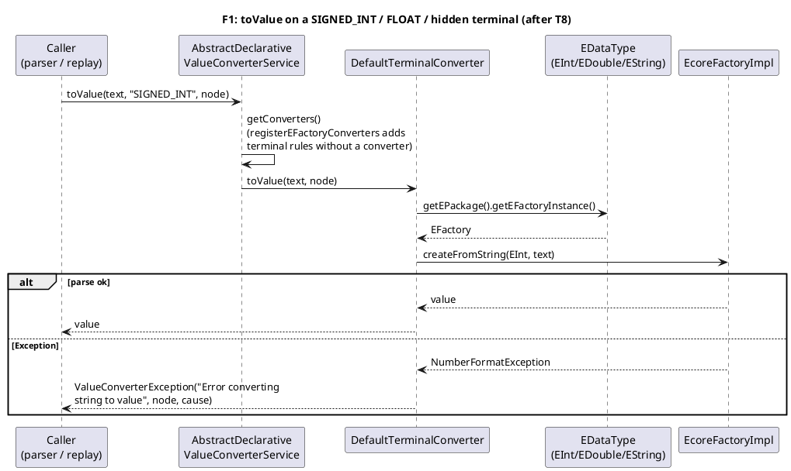
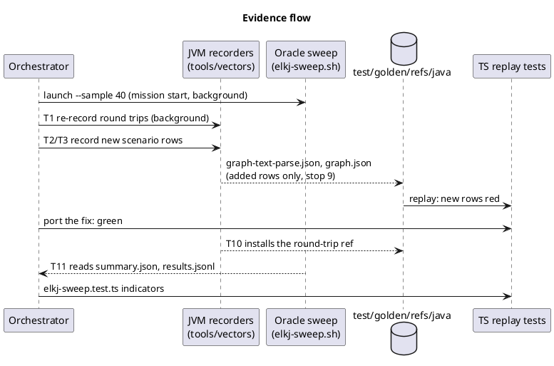

<!-- SPDX-License-Identifier: EPL-2.0 -->

# Data flow: text-follow-ups

## F1: a terminal converted after T8

```plantuml
@startuml
title F1: toValue on a SIGNED_INT / FLOAT / hidden terminal (after T8)
participant "Caller\n(parser / replay)" as C
participant "AbstractDeclarative\nValueConverterService" as S
participant "DefaultTerminalConverter" as D
participant "EDataType\n(EInt/EDouble/EString)" as T
participant "EcoreFactoryImpl" as F
C -> S: toValue(text, "SIGNED_INT", node)
S -> S: getConverters()\n(registerEFactoryConverters adds\nterminal rules without a converter)
S -> D: toValue(text, node)
D -> T: getEPackage().getEFactoryInstance()
T --> D: EFactory
D -> F: createFromString(EInt, text)
alt parse ok
  F --> D: value
  D --> C: value
else Exception
  F --> D: NumberFormatException
  D --> C: ValueConverterException("Error converting\nstring to value", node, cause)
end
@enduml
```

## Evidence first: vectors before code (T1–T3), background JVM jobs (F5, F6)

```plantuml
@startuml
title Evidence flow
participant Orchestrator as O
participant "JVM recorders\n(tools/vectors)" as V
participant "Oracle sweep\n(elkj-sweep.sh)" as W
database "test/golden/refs/java" as R
participant "TS replay tests" as TS
O -> W: launch --sample 40 (mission start, background)
O -> V: T1 re-record round trips (background)
O -> V: T2/T3 record new scenario rows
V --> R: graph-text-parse.json, graph.json\n(added rows only, stop 9)
R -> TS: replay: new rows red
O -> TS: port the fix: green
V --> R: T10 installs the round-trip ref
W --> O: T11 reads summary.json, results.jsonl
O -> TS: elkj-sweep.test.ts indicators
@enduml
```
