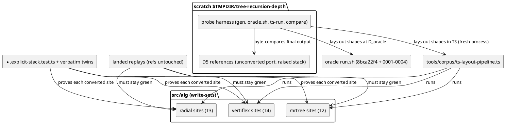

<!-- SPDX-License-Identifier: EPL-2.0 -->

# Component map: tree-recursion-depth

Proposed state. Each track owns one bundle; the probe harness and references are scratch (D6).

```plantuml
@startuml
skinparam componentStyle rectangle
package "scratch $TMPDIR/tree-recursion-depth" {
  [probe harness (gen, oracle.sh, ts-run, compare)] as H
  [D5 references (unconverted port, raised stack)] as R
}
package "src/alg (write-sets)" {
  [mrtree sites (T2)] as M
  [radial sites (T3)] as RA
  [vertiflex sites (T4)] as V
}
[*.explicit-stack.test.ts + verbatim twins] as T
[landed replays (refs untouched)] as LR
[oracle run.sh (8bca22f4 + 0001-0004)] as O
[tools/corpus/ts-layout-pipeline.ts] as P
H --> O : lays out shapes at D_oracle
H --> P : lays out shapes in TS (fresh process)
P --> M : runs
P --> RA : runs
P --> V : runs
T --> M : proves each converted site
T --> RA : proves each converted site
T --> V : proves each converted site
LR --> M : must stay green
LR --> RA : must stay green
LR --> V : must stay green
H --> R : byte-compares final output
@enduml
```
