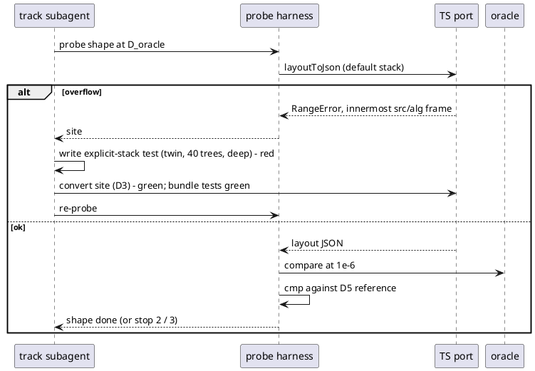

<!-- SPDX-License-Identifier: EPL-2.0 -->

# Data flow: one track's conversion loop (D2)

```plantuml
@startuml
participant "track subagent" as S
participant "probe harness" as H
participant "TS port" as TS
participant "oracle" as O
S -> H : probe shape at D_oracle
H -> TS : layoutToJson (default stack)
alt overflow
  TS --> H : RangeError, innermost src/alg frame
  H --> S : site
  S -> S : write explicit-stack test (twin, 40 trees, deep) - red
  S -> TS : convert site (D3) - green; bundle tests green
  S -> H : re-probe
else ok
  TS --> H : layout JSON
  H -> O : compare at 1e-6
  H -> H : cmp against D5 reference
  H --> S : shape done (or stop 2 / 3)
end
@enduml
```
