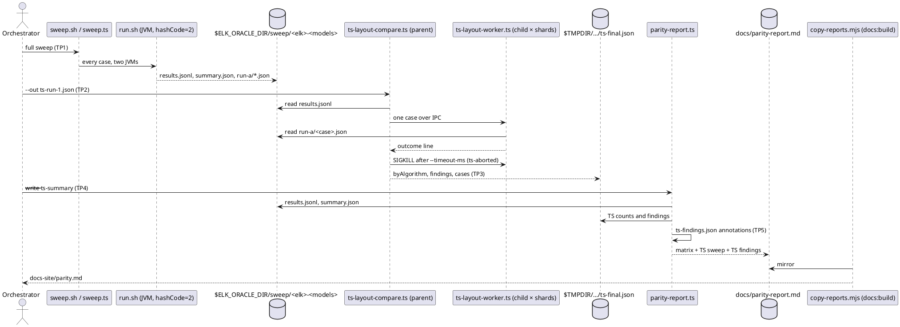

<!-- SPDX-License-Identifier: EPL-2.0 -->

# Data flow: oracle sweep to dashboard

```plantuml
@startuml
actor Orchestrator as o
participant "sweep.sh / sweep.ts" as sweep
participant "run.sh (JVM, hashCode=2)" as jvm
database "$ELK_ORACLE_DIR/sweep/<elk>-<models>" as cache
participant "ts-layout-compare.ts (parent)" as parent
participant "ts-layout-worker.ts (child × shards)" as child
database "$TMPDIR/…/ts-final.json" as summary
participant "parity-report.ts" as report
database "docs/parity-report.md" as md
participant "copy-reports.mjs (docs:build)" as site
o -> sweep : full sweep (TP1)
sweep -> jvm : every case, two JVMs
jvm --> cache : results.jsonl, summary.json, run-a/*.json
o -> parent : --out ts-run-1.json (TP2)
parent -> cache : read results.jsonl
parent -> child : one case over IPC
child -> cache : read run-a/<case>.json
child --> parent : outcome line
parent -> child : SIGKILL after --timeout-ms (ts-aborted)
parent --> summary : byAlgorithm, findings, cases (TP3)
o -> report : --write --ts-summary (TP4)
report -> cache : results.jsonl, summary.json
report -> summary : TS counts and findings
report -> report : ts-findings.json annotations (TP5)
report --> md : matrix + TS sweep + TS findings
site -> md : mirror
site --> o : docs-site/parity.md
@enduml
```
