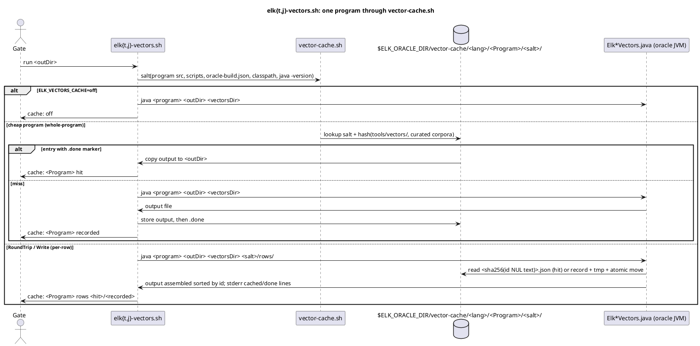
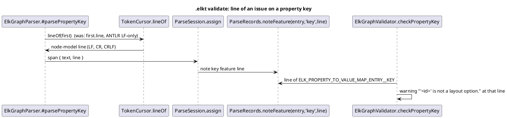

<!-- SPDX-License-Identifier: EPL-2.0 -->

# Data flow

## C4: one program through the cache (D1, D3)

```plantuml
@startuml
title elk{t,j}-vectors.sh: one program through vector-cache.sh
actor Gate
participant "elk{t,j}-vectors.sh" as S
participant "vector-cache.sh" as C
database "$ELK_ORACLE_DIR/vector-cache/<lang>/<Program>/<salt>/" as D
participant "Elk*Vectors.java (oracle JVM)" as J

Gate -> S : run <outDir>
S -> C : salt(program src, scripts, oracle-build.json, classpath, java -version)
alt ELK_VECTORS_CACHE=off
  S -> J : java <program> <outDir> <vectorsDir>
  S -> Gate : cache: off
else cheap program (whole-program)
  C -> D : lookup salt + hash(tools/vectors/, curated corpora)
  alt entry with .done marker
    D -> S : copy output to <outDir>
    S -> Gate : cache: <Program> hit
  else miss
    S -> J : java <program> <outDir> <vectorsDir>
    J -> S : output file
    S -> D : store output, then .done
    S -> Gate : cache: <Program> recorded
  end
else RoundTrip / Write (per-row)
  S -> J : java <program> <outDir> <vectorsDir> <salt>/rows/
  J -> D : read <sha256(id NUL text)>.json (hit) or record + tmp + atomic move
  J -> S : output assembled sorted by id; stderr cached/done lines
  S -> Gate : cache: <Program> rows <hit>/<recorded>
end
@enduml
```

## F7: a property key's line after a lone CR

```plantuml
@startuml
title .elkt validate: line of an issue on a property key
participant "ElkGraphParser.#parsePropertyKey" as P
participant "TokenCursor.lineOf" as L
participant "ParseSession.assign" as A
participant "ParseRecords.noteFeature(entry,'key',line)" as R
participant "ElkGraphValidator.checkPropertyKey" as V

P -> L : lineOf(first)  (was: first.line, ANTLR LF-only)
L -> P : node-model line (LF, CR, CRLF)
P -> A : span { text, line }
A -> R : note key feature line
V -> R : line of ELK_PROPERTY_TO_VALUE_MAP_ENTRY__KEY
V -> V : warning "'<id>' is not a layout option." at that line
@enduml
```
