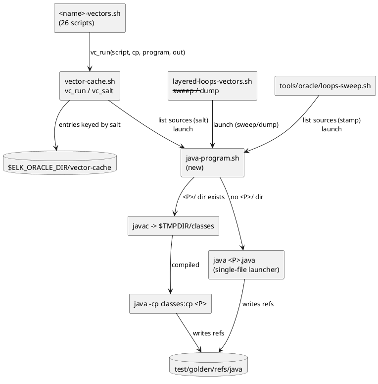

<!-- SPDX-License-Identifier: EPL-2.0 -->

# Component map: recorder launch after T1 (proposed)

```plantuml
@startuml
skinparam componentStyle rectangle
component "<name>-vectors.sh\n(26 scripts)" as S
component "vector-cache.sh\nvc_run / vc_salt" as VC
component "java-program.sh\n(new)" as JP
component "layered-loops-vectors.sh\n--sweep / --dump" as LL
component "tools/oracle/loops-sweep.sh" as SW
component "javac -> $TMPDIR/classes" as JC
component "java <P>.java\n(single-file launcher)" as L1
component "java -cp classes:cp <P>" as L2
database "test/golden/refs/java" as R
database "$ELK_ORACLE_DIR/vector-cache" as C

S --> VC : vc_run(script, cp, program, out)
VC --> JP : list sources (salt)\nlaunch
LL --> JP : launch (sweep/dump)
SW --> JP : list sources (stamp)\nlaunch
JP --> L1 : no <P>/ dir
JP --> JC : <P>/ dir exists
JC --> L2 : compiled
VC --> C : entries keyed by salt
L1 --> R : writes refs
L2 --> R : writes refs
@enduml
```
